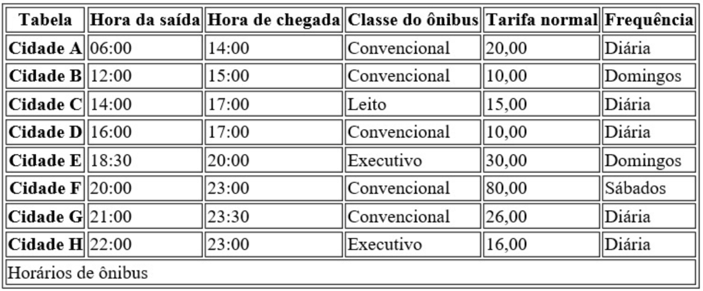
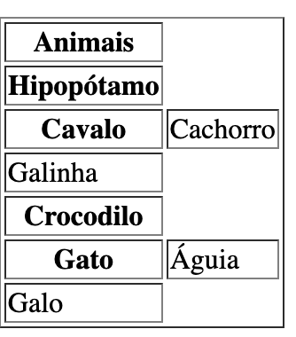
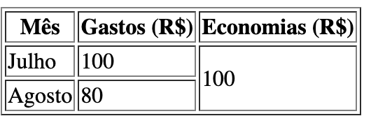
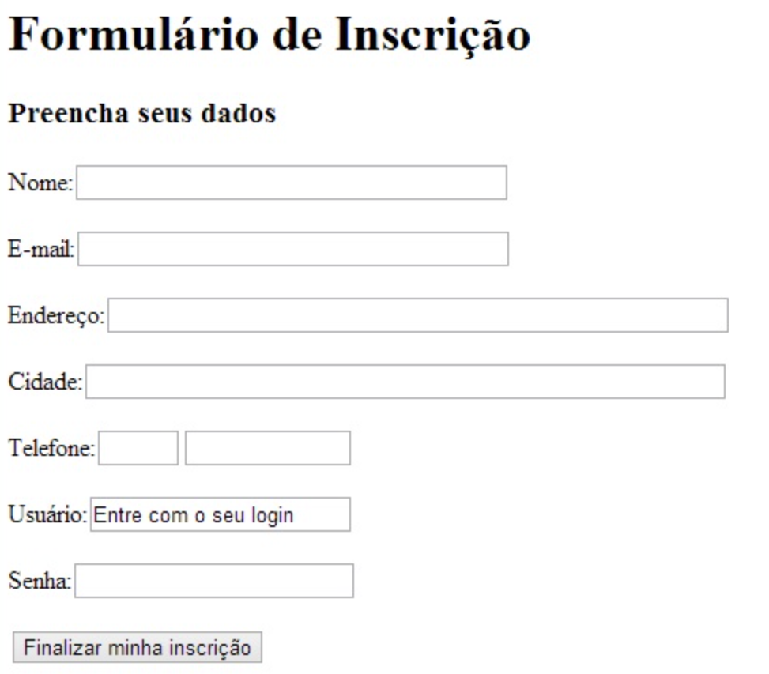
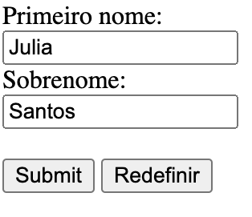
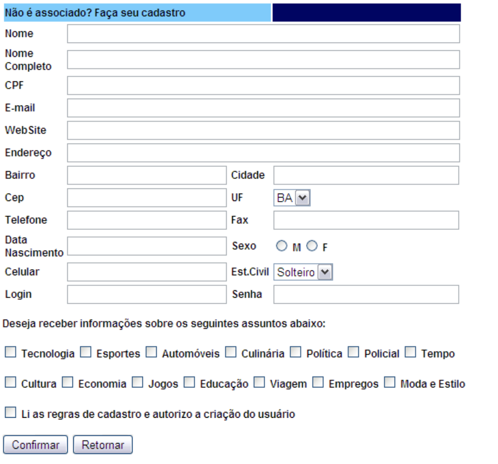

# Turma Web Design – Front End  

## Exercícios Tabelas e Formulários HTML

**1.	Crie uma página html em um arquivo chamado horários.html que contenha a tabela abaixo:**

  

**2.	Crie um arquivo chamado ex02.html que contenha uma tabela com uma coluna de Produto e outra coluna para Valores, adicione valores para as colunas.**
 

**3.	Crie um arquivo chamado ex03.html que contenha a seguinte tabela:**
 
  

**4.	Crie uma página html chamada ex04.html e implemente a seguinte tabela:**
 
  

 
**5.	Crie uma página html em um arquivo formularios.html que contenha o seguinte formulário:**

   

**6.	No mesmo arquivo do exercício anterior, faça um novo formulário seguindo o modelo:**

    

**7. O formulário abaixo representa uma página de cadastro de um usuário em um sistema interno de uma universidade.**\n
**Utilize as tags de formulário para desenvolvê-lo conforme abaixo:**

    

**8. Desenvolver o seguinte formulário de cadastro com as seguintes características.**
  * O campo UF, deverá vir com as siglas de todos os Estados Brasileiros para o usuário escolher 
  * O campo Est. Civil deverá vir com os seguintes dados: Solteiro, Casado, Viúvo e Divorciado 
  * O campo senha deverá ter os dados escondidos. Ou seja, ao digitar os valores para preencher o campo ele deverá está no formato de “password”

     

